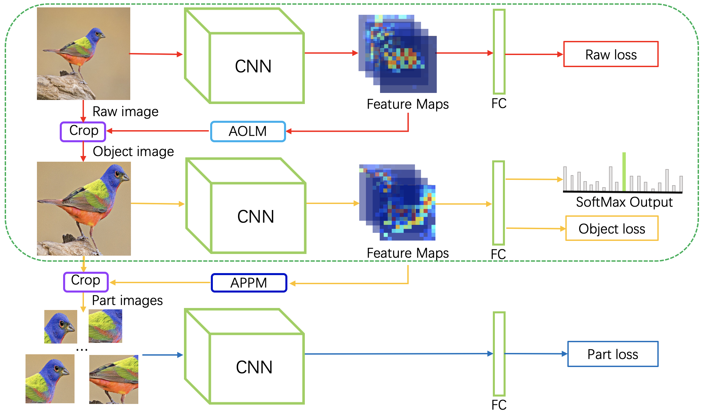

# TBMSL-Net

This is a PyTorch implementation of the paper "Three-branch and Mutil-scale learning for Fine-grained Image Recognition (TBMSL-Net)" (Fan Zhang, Guisheng Zhai, Meng Li, Yizhao Liu).



### Table of Contents
- <a href='#requirements'>Requirements</a>
- <a href='#datasets'>Datasets</a>
- <a href='#training TBMSL-Net'>Training TBMSL-Net</a>
- <a href='#evaluation'>Evaluation</a>
- <a href='#model'>Model</a>
- <a href='#reference'>Reference</a>


## Requirements
- python 3.7
- pytorch 1.3.1
- numpy 1.17.3
- scikit-image 0.16.2
- Tensorboard 1.15.0 
- TensorboardX 2.0
- tqdm 4.41.1
- imageio 2.6.1
- pillow 6.1.0

## Datasets
Download the [CUB-200-2011](http://www.vision.caltech.edu/visipedia-data/CUB-200-2011/CUB_200_2011.tgz) datasets and copy the contents of the extracted **images** folder into **datasets/CUB 200-2011/images**. 

Download the [FGVC-Aircraft](http://www.robots.ox.ac.uk/~vgg/data/fgvc-aircraft/archives/fgvc-aircraft-2013b.tar.gz) datasets and copy the contents of the extracted **data/images** folder into **datasets/CUB 200-2011/images**)

You can also try other fine-grained datasets. 

## Training TBMSL-Net
If you want to train the TBMSL-Net, just run ``python train.py``. You may need to change the configurations in ``config.py`` if your GPU memory is not enough. The parameter ``N_list`` is ``N1, N2, N3`` in the original paper and you can adjust them according to GPU memory. During training, the log file and checkpoint file will be saved in ``model_path`` directory. 

## Evaluation
If you want to test the TBMSL-Net, just run ``python test.py``. You need to specify the ``model_path`` in ``test.py`` to choose the checkpoint model for testing.

## Model
We also provide the checkpoint model trained by ourselves, you can download if from [Google Drive](https://drive.google.com/open?id=13ANynWz7O3QK0RdL4KqASW8X_vMb6V4B) for **CUB-200-2011** or download from [here](https://drive.google.com/open?id=1SYJHBVuG2uBlUROVrOCw2cpAKI2sWcOi) for **FGVC-Aircraft**. If you test on our provided model, you will get 89.6% and 94.5% test accuracy, respectively.

## Reference
If you are interested in our work and want to cite it, please acknowledge the following paper:

```
@misc{zhang2020threebranch,
    title={Three-branch and Mutil-scale learning for Fine-grained Image Recognition (TBMSL-Net)},
    author={Fan Zhang and Guisheng Zhai and Meng Li and Yizhao Liu},
    year={2020},
    eprint={2003.09150},
    archivePrefix={arXiv},
    primaryClass={cs.CV}
}
```

